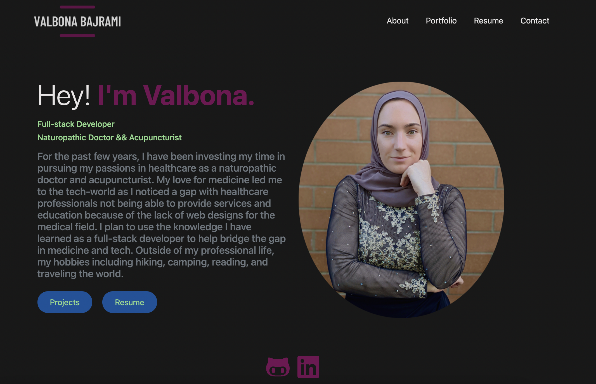
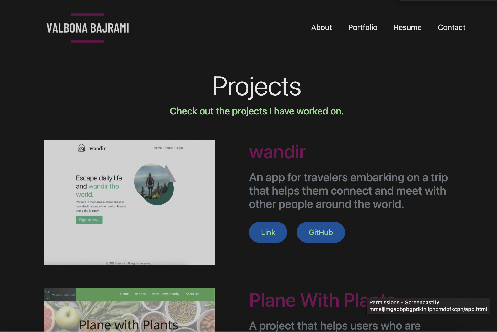

# React-Portfolio  

## Description

A professional portfolio, created using React, that displays information about me, the projects I have done through the coding bootcamp course, as well as ways to contact me.

## Table of Contents

- [Screenshots](#screenshots)
- [Technologies](#technologies)
- [License](#license)
- [Contributors](#contributors)
- [Questions](#questions)

## Technologies

- React-Bootstrap
- React
- HTML
- JavaScript
- CSS

## Screenshots

    

## Contributors

:woman_with_headscarf: [Valbona Bajrami](https://github.com/valbona1992)

## License

License is [MIT](https://opensource.org/licenses/MIT) standard license.

## Questions

GitHub: https://github.com/valbona1992  
Email me with any questions: valbona12@gmail.com
